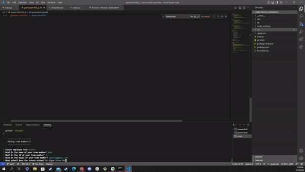

## Team Profile Generator
   
  
# About
 The purpose of this project was to use my newly learned OOP skills, and implement them into a project.  I was motivated to practice these skills because OOP can often be tricky and confusing and I wanted to solidify my grasp on the concept.
  
 # Table of Contents
 1. [Usage](#usage)
 2. [Installation](#installation)
 3. [Tests](#tests)
 4. [Questions](#questions)
 5. [License](#license)
  
# Usage
  
Run `node index.js` in your terminal to begin building your team! View walk through video here - [Screencastify](https://drive.google.com/file/d/1Hh8OvUXWSWGVNEL3rfPoM_zlng1hejew/view) 

# Questions
  
Feel free to reach me with any further questions, my GitHub is: [DFgalus](https//:github.com/DFgalus), and my email is: [damiangalus7@gmail.com](mailto:damiangalus7@gmail.com)

# Installation
  
Clone my code from the repository on my GitHub: https//:github.com/DFgalus.  A file system and inquirer module are also required for this application. Run `npm i` in the root, to install all dependencies.  
  
# Tests
Run `npm run test` to run all tests on contructors.
  
# License
Learn more about MIT here: 
https://opensource.org/licenses/MIT